# 🏛️ Lawsuits Analyser - Fluxo de Negócio Completo

## 📋 Como o Sistema Funciona de Ponta a Ponta

```mermaid
flowchart TD
    A[📅 Todo dia ao meio-dia<br/>Sistema desperta automaticamente] --> B[🔍 Procura por novos casos<br/>Clientes em processos criminais por estelionato]
    
    B --> C{📊 Encontrou casos<br/>para analisar?}
    C -->|Não| D[😴 Nada para fazer hoje<br/>Sistema volta a dormir]
    C -->|Sim| E[📝 Filtra casos já analisados<br/>Evita trabalho duplicado]
    
    E --> F[👤 Para cada cliente encontrado]
    F --> G[📄 Busca informações do cliente<br/>CPF, dados básicos]
    
    G --> H{❓ Conseguiu encontrar<br/>os dados do cliente?}
    H -->|Não| I[⚠️ Pula este cliente<br/>Vai para o próximo]
    H -->|Sim| J[🏛️ Consulta processos judiciais<br/>Verifica situação nos tribunais]
    
    J --> K{📋 Tem informações<br/>dos processos?}
    K -->|Não| L[🤖 Análise completa necessária<br/>Sistema vai investigar tudo]
    K -->|Sim| M[🧠 Inteligência Artificial analisa<br/>Lê e entende os processos]
    
    M --> N{⚖️ O que a IA descobriu<br/>sobre o cliente?}
    N -->|Foi condenado por crime| O[🚨 CLIENTE ALTO RISCO<br/>Bloqueia imediatamente]
    N -->|Foi inocentado/absolvido| P[✅ CLIENTE LIMPO<br/>Libera para operar]
    N -->|Processo ainda em andamento<br/>ou informação confusa| Q[🔍 PRECISA INVESTIGAR MAIS<br/>Análise completa necessária]
    
    O --> R[📤 Envia decisão<br/>BLOQUEAR cliente]
    P --> S[📤 Envia decisão<br/>LIBERAR cliente]
    
    Q --> L
    L --> T[🕵️ Sistema faz investigação completa<br/>Analisa tudo sobre o cliente]
    
    T --> U[📊 Calcula nível de risco<br/>De 1 seguro a 10 crítico]
    
    U --> V{🎯 Qual o nível<br/>de risco encontrado?}
    
    V -->|1 a 5<br/>Risco Baixo| W[✅ CLIENTE SEGURO<br/>Pode operar normalmente]
    V -->|6<br/>Risco Médio| X[⚠️ CLIENTE OK<br/>Mas precisa de monitoramento]
    V -->|7 a 8<br/>Risco Alto| Y[🟡 CLIENTE SUSPEITO<br/>Precisa de aprovação manual]
    V -->|9<br/>Risco Muito Alto| Z[🔶 CLIENTE MUITO SUSPEITO<br/>Aprovação urgente necessária]
    V -->|10<br/>Risco Extremo| AA[🚨 CLIENTE RISCO CRÍTICO<br/>Bloquear imediatamente]
    
    W --> BB[📤 Uma decisão<br/>LIBERAR cliente]
    X --> CC[📤 Uma decisão<br/>LIBERAR com observação]
    
    Y --> DD[📤 Duas decisões em sequência<br/>Primeiro Alerta preliminar<br/>Segundo Decisão de SUSPEITO]
    Z --> EE[📤 Duas decisões em sequência<br/>Primeiro Alerta preliminar<br/>Segundo Decisão de MUITO SUSPEITO]
    AA --> FF[📤 Duas decisões em sequência<br/>Primeiro Alerta preliminar<br/>Segundo Decisão de BLOQUEAR]
    
    DD --> KK[📞 Sistema solicita documentos<br/>Cliente tem prazo para responder]
    EE --> KK
    
    KK --> LL{📋 Cliente respondeu<br/>no prazo?}
    LL -->|Não respondeu| MM[🚨 DESCREDENCIAMENTO<br/>Cliente não colaborou]
    LL -->|Sim, enviou documentos| NN[🔍 Análise dos documentos<br/>Verificação da validade]
    
    NN --> OO{📄 Documentos são<br/>válidos e suficientes?}
    OO -->|Sim, documentos OK| PP[✅ NORMALIZAÇÃO<br/>Cliente liberado]
    OO -->|Não, insuficientes| QQ[🚨 DESCREDENCIAMENTO<br/>Documentos inadequados]
    
    R --> GG[✅ Decisão registrada no sistema]
    S --> GG
    BB --> GG
    CC --> GG
    FF --> GG
    PP --> GG
    MM --> GG
    QQ --> GG
    I --> HH[❌ Cliente não processado]
    
    GG --> II{🔄 Tem mais clientes<br/>para analisar?}
    HH --> II
    II -->|Sim| F
    II -->|Não| JJ[📊 Relatório final do dia<br/>Quantos analisados, quantos bloqueados<br/>Sistema volta a dormir até amanhã]
    
    %% Cores com alto contraste para melhor visibilidade
    style A fill:#1976d2,stroke:#0d47a1,stroke-width:2px,color:#ffffff
    style B fill:#7b1fa2,stroke:#4a148c,stroke-width:2px,color:#ffffff
    style M fill:#f57c00,stroke:#e65100,stroke-width:2px,color:#ffffff
    style T fill:#f57c00,stroke:#e65100,stroke-width:2px,color:#ffffff
    style O fill:#d32f2f,stroke:#b71c1c,stroke-width:2px,color:#ffffff
    style P fill:#388e3c,stroke:#1b5e20,stroke-width:2px,color:#ffffff
    style Q fill:#f57c00,stroke:#e65100,stroke-width:2px,color:#ffffff
    style R fill:#d32f2f,stroke:#b71c1c,stroke-width:2px,color:#ffffff
    style S fill:#388e3c,stroke:#1b5e20,stroke-width:2px,color:#ffffff
    style W fill:#388e3c,stroke:#1b5e20,stroke-width:2px,color:#ffffff
    style X fill:#388e3c,stroke:#1b5e20,stroke-width:2px,color:#ffffff
    style Y fill:#f9a825,stroke:#f57f17,stroke-width:2px,color:#000000
    style Z fill:#f9a825,stroke:#f57f17,stroke-width:2px,color:#000000
    style AA fill:#d32f2f,stroke:#b71c1c,stroke-width:2px,color:#ffffff
    style BB fill:#388e3c,stroke:#1b5e20,stroke-width:2px,color:#ffffff
    style CC fill:#388e3c,stroke:#1b5e20,stroke-width:2px,color:#ffffff
    style DD fill:#f9a825,stroke:#f57f17,stroke-width:2px,color:#000000
    style EE fill:#f9a825,stroke:#f57f17,stroke-width:2px,color:#000000
    style FF fill:#d32f2f,stroke:#b71c1c,stroke-width:2px,color:#ffffff
    style KK fill:#1976d2,stroke:#0d47a1,stroke-width:2px,color:#ffffff
    style NN fill:#7b1fa2,stroke:#4a148c,stroke-width:2px,color:#ffffff
    style PP fill:#388e3c,stroke:#1b5e20,stroke-width:2px,color:#ffffff
    style MM fill:#d32f2f,stroke:#b71c1c,stroke-width:2px,color:#ffffff
    style QQ fill:#d32f2f,stroke:#b71c1c,stroke-width:2px,color:#ffffff
```

## 🎯 Como o Sistema Toma Decisões

### 🔍 **FASE 1: DESCOBERTA**
- **Todos os dias ao meio-dia**, o sistema automaticamente procura por clientes que estão em processos criminais por estelionato
- Filtra apenas casos novos (não analisa o mesmo cliente repetidamente)

### 🏛️ **FASE 2: ANÁLISE JUDICIAL RÁPIDA**
- **Consulta tribunais** para ver a situação real dos processos
- **Inteligência Artificial** lê e entende as decisões judiciais
- **Decisão rápida** baseada no resultado dos processos:
  - ✅ **Inocentado/Absolvido** → Cliente liberado
  - 🚨 **Condenado** → Cliente bloqueado
  - ❓ **Processo em andamento** → Precisa investigar mais

### 🕵️ **FASE 3: INVESTIGAÇÃO COMPLETA** (quando necessário)
- Sistema analisa **TUDO** sobre o cliente:
  - Movimentações financeiras
  - Histórico de transações
  - Relacionamentos suspeitos
  - Padrões de comportamento
  - Conexões com pessoas problemáticas
- **Calcula risco de 1 a 10**

### 📊 **FASE 4: DECISÃO FINAL**
| **Nível** | **Situação** | **Ação do Sistema** |
|-----------|--------------|---------------------|
| **1-5** | 🟢 Cliente Seguro | Libera normalmente |
| **6** | 🟡 Cliente OK | Libera com monitoramento |
| **7-8** | 🟠 Cliente Suspeito | Solicita documentos → Reanálise |
| **9** | 🔶 Cliente Muito Suspeito | Solicita documentos → Reanálise |
| **10** | 🚨 Cliente Risco Crítico | Bloqueia imediatamente |

### 📞 **FASE 5: INTERAÇÃO COM CLIENTE** (apenas níveis 7-9)
Quando o cliente é classificado como **suspeito**, o sistema:

1. **📤 Solicita documentos** → Cliente recebe notificação para enviar comprovações
2. **⏰ Aguarda resposta** → Cliente tem prazo determinado para responder
3. **🔍 Analisa documentos** → Se enviados, verifica validade e suficiência
4. **📋 Decisão final**:
   - ✅ **Documentos válidos** → Cliente normalizado (liberado)
   - ❌ **Não respondeu** → Cliente descredenciado (bloqueado)
   - ❌ **Documentos insuficientes** → Cliente descredenciado (bloqueado)

## 🎨 Legenda de Cores

- 🔵 **Azul**: Início, processos automáticos e solicitações
- 🟣 **Roxo**: Busca, coleta de informações e análise de documentos
- 🟠 **Laranja**: Análises inteligentes (IA)
- 🟢 **Verde**: Decisões positivas (liberar/normalizar cliente)
- 🟡 **Amarelo**: Decisões de cautela (suspeito)
- 🔴 **Vermelho**: Decisões restritivas (bloquear/descredenciar)

## 💡 Por que Duas Decisões em Casos Suspeitos?

Quando o cliente é considerado **suspeito** (níveis 7-10), o sistema:

1. **🚨 Primeiro**: Envia um alerta preliminar para o time de compliance
2. **📋 Depois**: Envia a decisão final específica

Isso garante que casos de **alto risco** tenham **dupla atenção** e **rastreamento adequado**.

## 📈 Benefícios do Sistema

- ✅ **Automatização completa**: Funciona 24/7 sem intervenção humana
- ✅ **Análise inteligente**: IA entende contexto jurídico real
- ✅ **Decisões rápidas**: Casos simples resolvidos em minutos
- ✅ **Investigação profunda**: Casos complexos analisados completamente
- ✅ **Dupla segurança**: Casos suspeitos têm atenção especial
- ✅ **Histórico completo**: Todas as decisões são registradas e auditáveis
