# 🏛️ Lawsuits Analyser - Fluxo de Negócio Completo

## 📋 Como o Sistema Funciona de Ponta a Ponta

```mermaid
flowchart TD
    A[📅 Todo dia ao meio-dia<br/>Sistema desperta automaticamente] --> B[🔍 Procura por novos casos<br/>Clientes em processos criminais por estelionato]
    
    B --> C{📊 Encontrou casos<br/>para analisar?}
    C -->|Não| D[😴 Nada para fazer hoje<br/>Sistema volta a dormir]
    C -->|Sim| E[📝 Filtra casos já analisados<br/>Evita trabalho duplicado]
    
    E --> F[👤 Para cada cliente encontrado]
    F --> G[📄 Busca informações do cliente<br/>CPF, dados básicos]
    
    G --> H{❓ Conseguiu encontrar<br/>os dados do cliente?}
    H -->|Não| I[⚠️ Pula este cliente<br/>Vai para o próximo]
    H -->|Sim| J[🏛️ Consulta processos judiciais<br/>Verifica situação nos tribunais]
    
    J --> K{📋 Tem informações<br/>dos processos?}
    K -->|Não| L[🤖 Análise completa necessária<br/>Sistema vai investigar tudo]
    K -->|Sim| M[🧠 Inteligência Artificial analisa<br/>Lê e entende os processos]
    
    M --> N{⚖️ O que a IA descobriu<br/>sobre o cliente?}
    N -->|Foi condenado por crime| O[🚨 CLIENTE PERIGOSO<br/>Bloqueia imediatamente]
    N -->|Foi inocentado/absolvido| P[✅ CLIENTE LIMPO<br/>Libera para operar]
    N -->|Processo ainda em andamento<br/>ou informação confusa| Q[🔍 PRECISA INVESTIGAR MAIS<br/>Análise completa necessária]
    
    O --> R[📤 Envia decisão<br/>BLOQUEAR cliente]
    P --> S[📤 Envia decisão<br/>LIBERAR cliente]
    
    Q --> L
    L --> T[🕵️ Sistema faz investigação completa<br/>Analisa tudo sobre o cliente]
    
    T --> U[📊 Calcula nível de risco<br/>De 1 seguro a 10 perigoso]
    
    U --> V{🎯 Qual o nível<br/>de risco encontrado?}
    
    V -->|1 a 5<br/>Risco Baixo| W[✅ CLIENTE SEGURO<br/>Pode operar normalmente]
    V -->|6<br/>Risco Médio| X[⚠️ CLIENTE OK<br/>Mas precisa de monitoramento]
    V -->|7 a 8<br/>Risco Alto| Y[🟡 CLIENTE SUSPEITO<br/>Precisa de aprovação manual]
    V -->|9<br/>Risco Muito Alto| Z[🔶 CLIENTE MUITO SUSPEITO<br/>Aprovação urgente necessária]
    V -->|10<br/>Risco Extremo| AA[🚨 CLIENTE PERIGOSO<br/>Bloquear imediatamente]
    
    W --> BB[📤 Uma decisão<br/>LIBERAR cliente]
    X --> CC[📤 Uma decisão<br/>LIBERAR com observação]
    
    Y --> DD[📤 Duas decisões em sequência<br/>Primeiro Alerta preliminar<br/>Segundo Decisão de SUSPEITO]
    Z --> EE[📤 Duas decisões em sequência<br/>Primeiro Alerta preliminar<br/>Segundo Decisão de MUITO SUSPEITO]
    AA --> FF[📤 Duas decisões em sequência<br/>Primeiro Alerta preliminar<br/>Segundo Decisão de BLOQUEAR]
    
    R --> GG[✅ Decisão registrada no sistema]
    S --> GG
    BB --> GG
    CC --> GG
    DD --> GG
    EE --> GG
    FF --> GG
    I --> HH[❌ Cliente não processado]
    
    GG --> II{🔄 Tem mais clientes<br/>para analisar?}
    HH --> II
    II -->|Sim| F
    II -->|Não| JJ[📊 Relatório final do dia<br/>Quantos analisados, quantos bloqueados<br/>Sistema volta a dormir até amanhã]
    
    %% Cores com alto contraste para melhor visibilidade
    style A fill:#1976d2,stroke:#0d47a1,stroke-width:2px,color:#ffffff
    style B fill:#7b1fa2,stroke:#4a148c,stroke-width:2px,color:#ffffff
    style M fill:#f57c00,stroke:#e65100,stroke-width:2px,color:#ffffff
    style T fill:#f57c00,stroke:#e65100,stroke-width:2px,color:#ffffff
    style O fill:#d32f2f,stroke:#b71c1c,stroke-width:2px,color:#ffffff
    style P fill:#388e3c,stroke:#1b5e20,stroke-width:2px,color:#ffffff
    style Q fill:#f57c00,stroke:#e65100,stroke-width:2px,color:#ffffff
    style R fill:#d32f2f,stroke:#b71c1c,stroke-width:2px,color:#ffffff
    style S fill:#388e3c,stroke:#1b5e20,stroke-width:2px,color:#ffffff
    style W fill:#388e3c,stroke:#1b5e20,stroke-width:2px,color:#ffffff
    style X fill:#388e3c,stroke:#1b5e20,stroke-width:2px,color:#ffffff
    style Y fill:#f9a825,stroke:#f57f17,stroke-width:2px,color:#000000
    style Z fill:#f9a825,stroke:#f57f17,stroke-width:2px,color:#000000
    style AA fill:#d32f2f,stroke:#b71c1c,stroke-width:2px,color:#ffffff
    style BB fill:#388e3c,stroke:#1b5e20,stroke-width:2px,color:#ffffff
    style CC fill:#388e3c,stroke:#1b5e20,stroke-width:2px,color:#ffffff
    style DD fill:#f9a825,stroke:#f57f17,stroke-width:2px,color:#000000
    style EE fill:#f9a825,stroke:#f57f17,stroke-width:2px,color:#000000
    style FF fill:#d32f2f,stroke:#b71c1c,stroke-width:2px,color:#ffffff
```

## 🎯 Como o Sistema Toma Decisões

### 🔍 **FASE 1: DESCOBERTA**
- **Todos os dias ao meio-dia**, o sistema automaticamente procura por clientes que estão em processos criminais por estelionato
- Filtra apenas casos novos (não analisa o mesmo cliente repetidamente)

### 🏛️ **FASE 2: ANÁLISE JUDICIAL RÁPIDA**
- **Consulta tribunais** para ver a situação real dos processos
- **Inteligência Artificial** lê e entende as decisões judiciais
- **Decisão rápida** baseada no resultado dos processos:
  - ✅ **Inocentado/Absolvido** → Cliente liberado
  - 🚨 **Condenado** → Cliente bloqueado
  - ❓ **Processo em andamento** → Precisa investigar mais

### 🕵️ **FASE 3: INVESTIGAÇÃO COMPLETA** (quando necessário)
- Sistema analisa **TUDO** sobre o cliente:
  - Movimentações financeiras
  - Histórico de transações
  - Relacionamentos suspeitos
  - Padrões de comportamento
  - Conexões com pessoas problemáticas
- **Calcula risco de 1 a 10**

### 📊 **FASE 4: DECISÃO FINAL**
| **Nível** | **Situação** | **Ação do Sistema** |
|-----------|--------------|---------------------|
| **1-5** | 🟢 Cliente Seguro | Libera normalmente |
| **6** | 🟡 Cliente OK | Libera com monitoramento |
| **7-8** | 🟠 Cliente Suspeito | Envia para aprovação manual |
| **9** | 🔶 Cliente Muito Suspeito | Aprovação urgente necessária |
| **10** | 🚨 Cliente Perigoso | Bloqueia imediatamente |

## 🎨 Legenda de Cores

- 🔵 **Azul**: Início e processos automáticos
- 🟣 **Roxo**: Busca e coleta de informações
- 🟠 **Laranja**: Análises inteligentes (IA)
- 🟢 **Verde**: Decisões positivas (liberar cliente)
- 🟡 **Amarelo**: Decisões de cautela (suspeito)
- 🔴 **Vermelho**: Decisões restritivas (bloquear)

## 🔍 O que o Sistema Analisa na Investigação Completa?

Quando precisa fazer uma **análise profunda**, o Lavandowski examina **TUDO** sobre o cliente:

### 💰 **Movimentações Financeiras**
- **Volume de transações**: Quanto dinheiro movimenta por mês
- **Frequência**: Quantas operações faz por dia/semana
- **Horários**: Se transaciona em horários estranhos (madrugada, feriados)
- **Valores**: Se há transações muito altas ou muito baixas suspeitas
- **Padrões**: Se o comportamento mudou drasticamente

### 🏢 **Perfil do Negócio**
- **Compatibilidade**: Se as transações fazem sentido com o tipo de empresa
- **Faturamento declarado**: Se movimenta mais dinheiro do que deveria
- **Atividade econômica**: Se o ramo de negócio é de alto risco
- **Localização**: Se opera em regiões problemáticas

### 👥 **Relacionamentos e Conexões**
- **Pessoas ligadas**: Se tem sócios ou parentes em listas restritivas
- **Empresas relacionadas**: Se tem conexão com outras empresas suspeitas
- **Políticos**: Se tem ligação com pessoas politicamente expostas (PEPs)
- **Histórico familiar**: Se familiares têm problemas com a justiça

### 🚨 **Histórico de Problemas**
- **Processos anteriores**: Se já teve outros problemas judiciais
- **Listas restritivas**: Se aparece em listas de sanções internacionais
- **Órgãos reguladores**: Se foi multado por BACEN, CVM, etc.
- **Análises passadas**: Se já foi considerado suspeito antes

### 🌍 **Operações Internacionais**
- **Países de risco**: Se transaciona com países problemáticos
- **Moedas estrangeiras**: Se usa muito cartão no exterior
- **Transferências**: Se recebe/envia dinheiro do/para exterior
- **Padrões geográficos**: Se as operações fazem sentido geograficamente

### 🎯 **Indicadores de Lavagem de Dinheiro**
- **Estruturação**: Se quebra transações grandes em várias pequenas
- **Smurfing**: Se usa várias contas para movimentar dinheiro
- **Operações circulares**: Se o dinheiro "dá voltas" sem propósito
- **Cash intensivo**: Se usa muito dinheiro em espécie
- **Velocidade**: Se o dinheiro entra e sai muito rapidamente

## 💡 Por que Duas Decisões em Casos Suspeitos?

Quando o cliente é considerado **suspeito** (níveis 7-10), o sistema:

1. **🚨 Primeiro**: Envia um alerta preliminar para o time de compliance
2. **📋 Depois**: Envia a decisão final específica

Isso garante que casos de **alto risco** tenham **dupla atenção** e **rastreamento adequado**.

## 📈 Benefícios do Sistema

- ✅ **Automatização completa**: Funciona 24/7 sem intervenção humana
- ✅ **Análise inteligente**: IA entende contexto jurídico real
- ✅ **Decisões rápidas**: Casos simples resolvidos em minutos
- ✅ **Investigação profunda**: Casos complexos analisados completamente
- ✅ **Dupla segurança**: Casos suspeitos têm atenção especial
- ✅ **Histórico completo**: Todas as decisões são registradas e auditáveis
